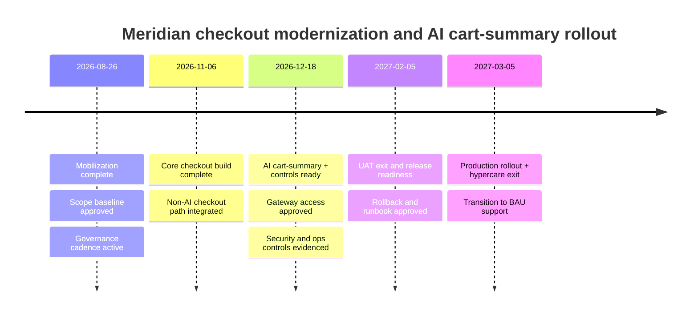

# Meridian Retail Group — milestone timeline

```mermaid
timeline
    title Meridian checkout modernization and AI cart-summary rollout
    2026-08-26 : Mobilization complete
               : Scope baseline approved
               : Governance cadence active
    2026-11-06 : Core checkout build complete
               : Non-AI checkout path integrated
    2026-12-18 : AI cart-summary + controls ready
               : Gateway access approved
               : Security and ops controls evidenced
    2027-02-05 : UAT exit and release readiness
               : Rollback and runbook approved
    2027-03-05 : Production rollout + hypercare exit
               : Transition to BAU support
```
