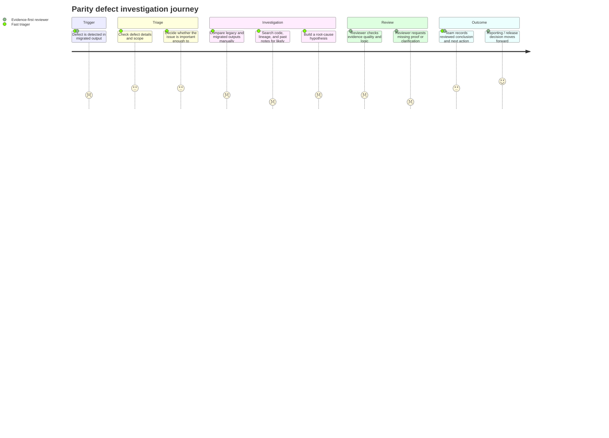

# 02-personas-journey

**Source quality note**  
This draft is based on public research and industry sources, not project interviews. Treat both personas as **unverified** until checked with real users. Public evidence used here points to slow incident resolution, business users often finding issues first, and a strong need for lineage, documentation, and root-cause efficiency.

## Persona 1 — Fast triager under delivery pressure

**Name:** Fast triager  
**Goal:** Find the likely cause of a parity defect quickly enough to unblock reporting or release decisions.  
**Friction:** Investigation is manual, spread across code, data, lineage, and past notes; the engineer loses time switching between tools and reconstructing context. Public data-quality research reports long incident detection and resolution times, and root-cause analysis is called out as a core pain.  
**Current workaround:** Run SQL checks, compare outputs manually, search old tickets/notebooks, and ask teammates for context.

## Persona 2 — Evidence-first reviewer

**Name:** Evidence-first reviewer  
**Goal:** Accept or reject an investigation outcome with enough traceable evidence that the team can trust the conclusion.  
**Friction:** Even when an engineer has a likely answer, the evidence is often scattered or incomplete, so review takes longer and trust stays low. Public guidance on data-quality management emphasizes documentation, lineage, asset relationships, and incident process as necessary for reliable resolution.  
**Current workaround:** Re-run parts of the investigation manually, inspect code and lineage again, and ask for a cleaner summary before approving the conclusion.

## Journey map

## Top 3 unmet needs

1. **A faster path from defect to likely root cause**  
   The low point in the journey is the manual investigation step, where the engineer must compare outputs, code, and context across multiple places.

2. **A reusable evidence package, not just an answer**  
   Reviewers need assumptions, validation steps, and traceable evidence, not only a suggested cause.

3. **Shared investigation context instead of person-to-person memory**  
   Current workarounds rely too much on past tickets, notebooks, and teammate knowledge, which slows repeat investigations and increases inconsistency.

## Why these needs are plausible from public research

- Data-quality incident resolution is still slow in many teams, with incidents and business impact remaining high.
- Public root-cause analysis guidance for data engineers emphasizes lineage, code inspection, past incident documentation, and peer support, which matches the manual steps in this journey.
- A large share of teams report that business stakeholders identify issues first, which increases pressure for faster and more trusted investigation workflows.
