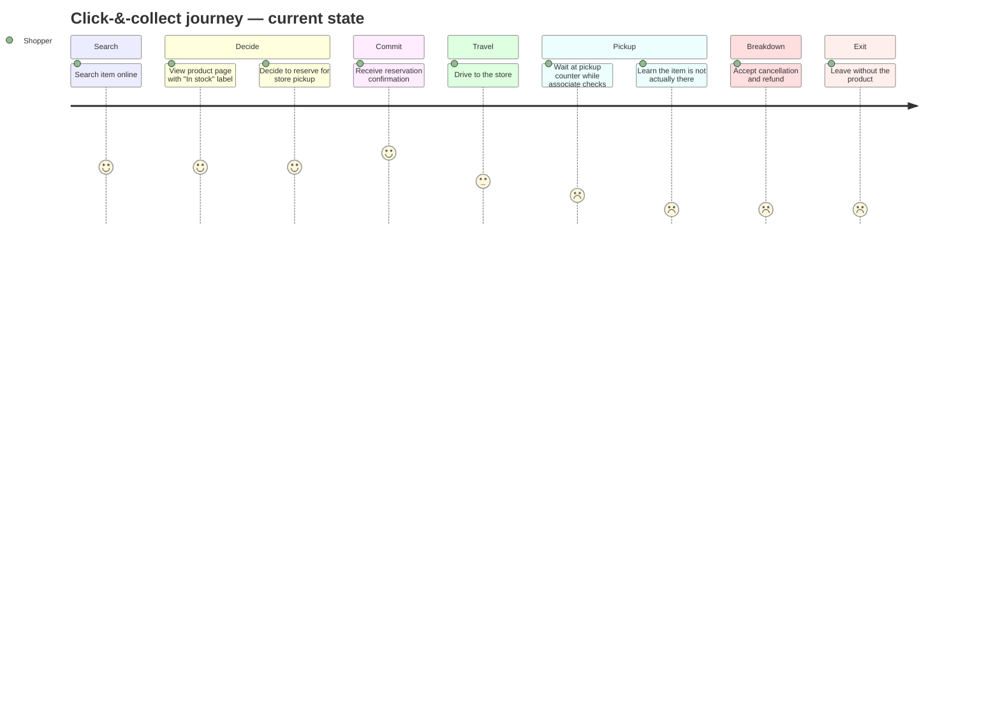

# 01-journey-map

**Feature:** Meridian availability assistant  
**Input source:** Supplied current-state click-&-collect journey

## Current-state journey

## Step-by-step evidence map

| Step | User action | Emotion | Frustrations |
|---|---|---|---|
| 1 | Search item online | Hopeful | Hard to know whether online stock reflects the real shelf |
| 2 | View product page with “In stock” label | Reassured | Label implies stronger certainty than the system may really have |
| 3 | Reserve for store pickup | Confident | User assumes availability means the item is effectively there |
| 4 | Receive reservation confirmation | Committed | Confirmation increases expectation but may not reduce uncertainty |
| 5 | Drive to the store | Invested | Time and travel cost are now committed before truth is verified |
| 6 | Wait at pickup counter while associate checks shelf | Anxious | User sees manual checking, which suggests the system may not actually know |
| 7 | Learn the item is not there | Frustrated / betrayed | False promise, wasted trip, delayed need, damaged trust |
| 8 | Accept cancellation and refund | Angry / resigned | Refund does not recover lost time or restore trust |
| 9 | Leave without the product | Disappointed | User may abandon future click-&-collect use |

## Top 3 frustrations

1. The “In stock” label creates stronger certainty than the retailer can support.
2. Reservation and confirmation happen before the system proves the item is really available.
3. The real emotional break happens at pickup, when the customer learns the promise was false.

## Drop-off point

**Primary drop-off:** after the cancellation/refund moment, when the shopper leaves without the product and loses trust in click-&-collect for future purchases.

## Redesign signal

The most important redesign target is not the search step. It is the **availability promise moment** on the product page and confirmation flow, because that is where false certainty enters the journey and causes the later breakdown.
