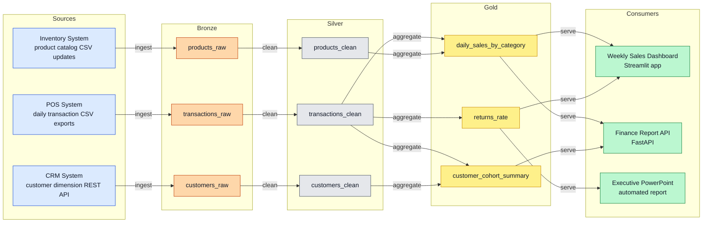

# lineage-diagram.md

```mermaid
flowchart LR
    classDef source fill:#dbeafe,stroke:#1d4ed8,color:#111827;
    classDef bronze fill:#fed7aa,stroke:#c2410c,color:#111827;
    classDef silver fill:#e5e7eb,stroke:#4b5563,color:#111827;
    classDef gold fill:#fef08a,stroke:#ca8a04,color:#111827;
    classDef consumer fill:#bbf7d0,stroke:#15803d,color:#111827;

    subgraph Sources
        POS["POS System<br/>daily transaction CSV exports"]
        CRM["CRM System<br/>customer dimension REST API"]
        INV["Inventory System<br/>product catalog CSV updates"]
    end

    subgraph Bronze
        B1["transactions_raw"]
        B2["customers_raw"]
        B3["products_raw"]
    end

    subgraph Silver
        S1["transactions_clean"]
        S2["customers_clean"]
        S3["products_clean"]
    end

    subgraph Gold
        G1["daily_sales_by_category"]
        G2["returns_rate"]
        G3["customer_cohort_summary"]
    end

    subgraph Consumers
        C1["Weekly Sales Dashboard<br/>Streamlit app"]
        C2["Finance Report API<br/>FastAPI"]
        C3["Executive PowerPoint<br/>automated report"]
    end

    POS -->|ingest| B1
    CRM -->|ingest| B2
    INV -->|ingest| B3

    B1 -->|clean| S1
    B2 -->|clean| S2
    B3 -->|clean| S3

    S1 -->|aggregate| G1
    S1 -->|aggregate| G2
    S1 -->|aggregate| G3
    S2 -->|aggregate| G3
    S3 -->|aggregate| G1

    G1 -->|serve| C1
    G2 -->|serve| C1

    G1 -->|serve| C2
    G3 -->|serve| C2

    G2 -->|serve| C3

    class POS,CRM,INV source;
    class B1,B2,B3 bronze;
    class S1,S2,S3 silver;
    class G1,G2,G3 gold;
    class C1,C2,C3 consumer;
```
